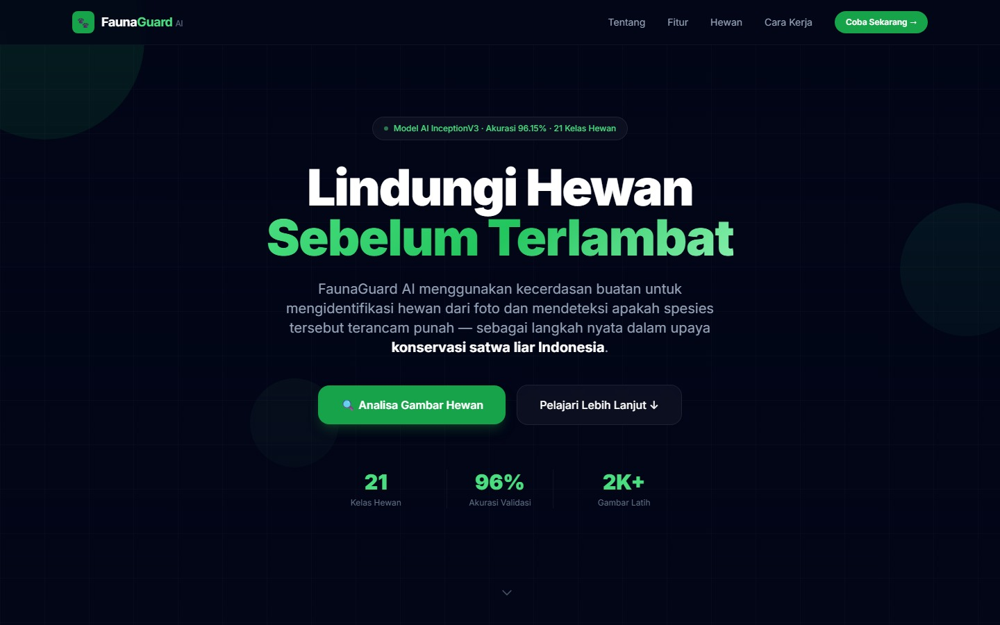
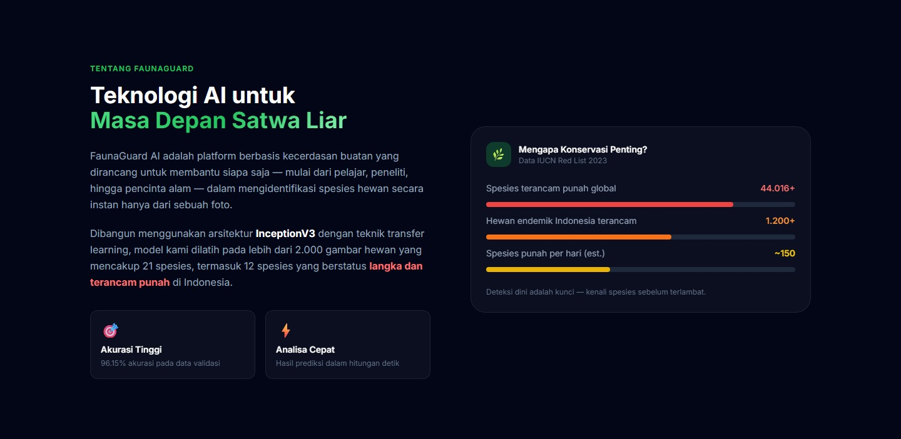
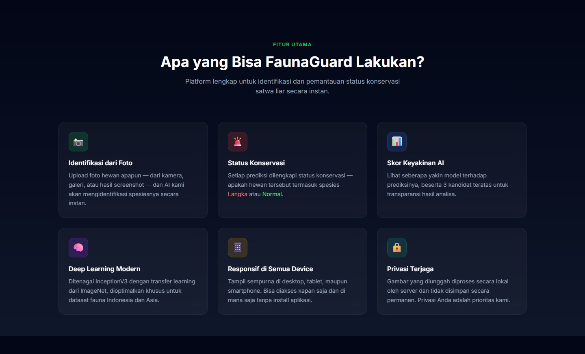
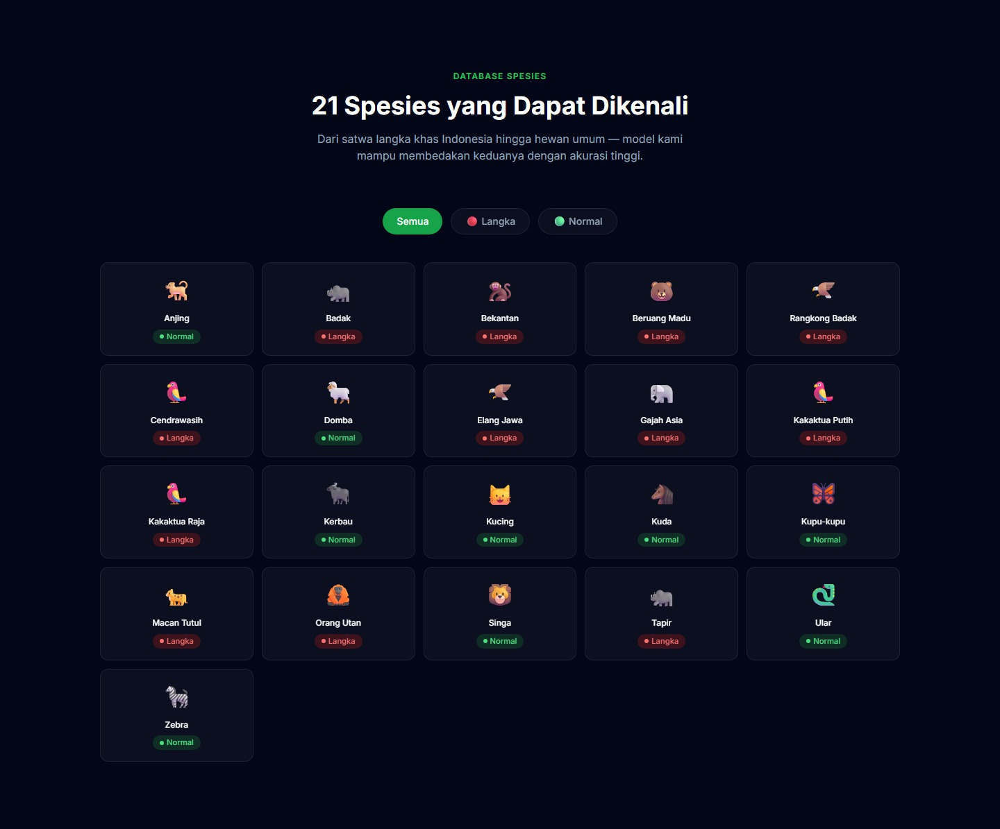
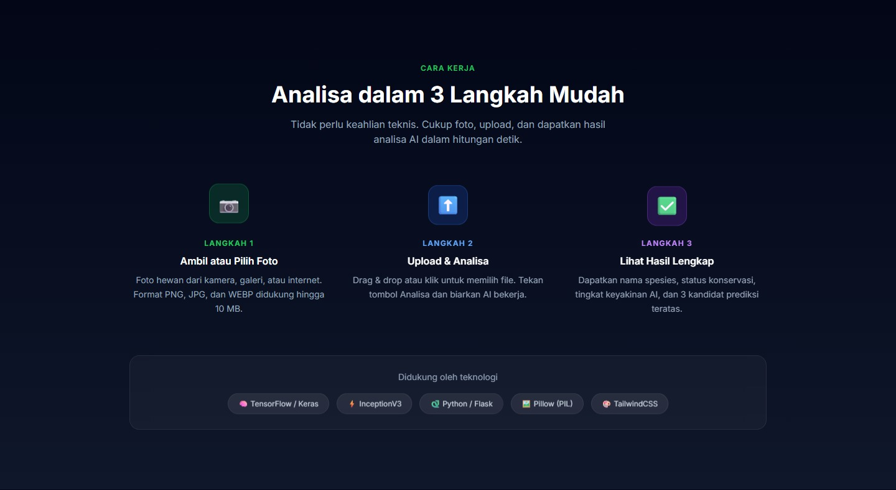

<!-- ══════════════════════════════════════════════════════════
     HEADER
══════════════════════════════════════════════════════════ -->

<p align="center">
  
</p>

<br />

<p align="center">
  
</p>

<h1 align="center">🐾 FaunaGuard AI</h1>

<p align="center">
  <b>Platform Kecerdasan Buatan untuk Identifikasi & Konservasi Satwa Liar Indonesia</b>
</p>

<p align="center">
  
  &nbsp;
  
  &nbsp;
  
  &nbsp;
  
  &nbsp;
  
</p>

<p align="center">
  <a href="#-tentang-proyek">Tentang</a> &nbsp;•&nbsp;
  <a href="#-fitur-utama">Fitur</a> &nbsp;•&nbsp;
  <a href="#-prasyarat">Prasyarat</a> &nbsp;•&nbsp;
  <a href="#-instalasi">Instalasi</a> &nbsp;•&nbsp;
  <a href="#-struktur-proyek">Struktur</a> &nbsp;•&nbsp;
  <a href="#-lisensi">Lisensi</a>
</p>

<br />

---

<!-- ══════════════════════════════════════════════════════════
     TENTANG
══════════════════════════════════════════════════════════ -->

## 🌿 Tentang Proyek

<p>
  <b>FaunaGuard AI</b> adalah aplikasi web berbasis <i>deep learning</i> yang mampu mengidentifikasi spesies hewan dari sebuah foto dan sekaligus mendeteksi apakah hewan tersebut berstatus <b>Langka (Terancam Punah)</b> atau <b>Normal</b>.
</p>

<p>
  Dibangun menggunakan arsitektur <b>InceptionV3</b> dengan teknik <i>transfer learning</i> dari ImageNet, model dilatih pada dataset <b>2.087 gambar</b> yang mencakup <b>21 kelas spesies</b> — termasuk 12 satwa endemik Indonesia yang terancam punah.
</p>

<br />

<table align="center">
  <tr>
    <td align="center" width="33%">
      <br />
      <b>🌿 Tentang &amp; Konservasi</b>
    </td>
    <td align="center" width="33%">
      <br />
      <b>✨ Fitur Utama</b>
    </td>
    <td align="center" width="33%">
      <br />
      <b>🦁 Database 21 Spesies</b>
    </td>
  </tr>
  <tr>
    <td align="center" colspan="3">
      <br />
      <b>🔄 Cara Kerja &amp; Tech Stack</b>
    </td>
  </tr>
</table>

<br />

---

<!-- ══════════════════════════════════════════════════════════
     FITUR
══════════════════════════════════════════════════════════ -->

## ✨ Fitur Utama

<table>
  <tr>
    <td width="50%">
      <h4>📸 Identifikasi dari Foto</h4>
      <p>Upload foto hewan dari kamera, galeri, atau internet. Drag &amp; Drop didukung. Format PNG, JPG, JPEG, WEBP hingga 10 MB.</p>
    </td>
    <td width="50%">
      <h4>🚨 Status Konservasi Real-Time</h4>
      <p>Setiap hasil prediksi dilengkapi status konservasi otomatis — <b>Langka</b> (merah) atau <b>Normal</b> (hijau).</p>
    </td>
  </tr>
  <tr>
    <td width="50%">
      <h4>📊 Confidence Score Visual</h4>
      <p>Tingkat keyakinan AI ditampilkan dalam bentuk progress bar animasi dengan persentase akurasi yang jelas.</p>
    </td>
    <td width="50%">
      <h4>🧠 Deep Learning InceptionV3</h4>
      <p>Menggunakan transfer learning dari ImageNet, dioptimalkan khusus untuk dataset fauna Indonesia &amp; Asia Tenggara.</p>
    </td>
  </tr>
  <tr>
    <td width="50%">
      <h4>📱 Responsif di Semua Device</h4>
      <p>UI dibangun dengan TailwindCSS CDN — tampil sempurna di desktop, tablet, dan smartphone tanpa instalasi tambahan.</p>
    </td>
    <td width="50%">
      <h4>⚡ Inferensi Cepat</h4>
      <p>Prediksi menggunakan REST API JSON endpoint <code>/predict</code>, dengan hasil dalam hitungan detik langsung di halaman yang sama.</p>
    </td>
  </tr>
</table>

<br />

---

<!-- ══════════════════════════════════════════════════════════
     DATABASE SPESIES
══════════════════════════════════════════════════════════ -->

## 🦁 Database Spesies (21 Kelas)

<details>
  <summary><b>🔴 Hewan Langka / Terancam Punah (12 Spesies) — klik untuk lihat</b></summary>

  <br />

  <table>
    <tr>
      <th align="center">No</th>
      <th align="center">Nama Hewan</th>
      <th align="center">Nama Ilmiah</th>
      <th align="center">Status</th>
    </tr>
    <tr>
      <td align="center">1</td>
      <td><b>Badak</b></td>
      <td><i>Rhinoceros sondaicus</i></td>
      <td align="center">🔴 Langka</td>
    </tr>
    <tr>
      <td align="center">2</td>
      <td><b>Bekantan</b></td>
      <td><i>Nasalis larvatus</i></td>
      <td align="center">🔴 Langka</td>
    </tr>
    <tr>
      <td align="center">3</td>
      <td><b>Beruang Madu</b></td>
      <td><i>Helarctos malayanus</i></td>
      <td align="center">🔴 Langka</td>
    </tr>
    <tr>
      <td align="center">4</td>
      <td><b>Rangkong Badak</b></td>
      <td><i>Buceros rhinoceros</i></td>
      <td align="center">🔴 Langka</td>
    </tr>
    <tr>
      <td align="center">5</td>
      <td><b>Cendrawasih</b></td>
      <td><i>Paradisaea minor</i></td>
      <td align="center">🔴 Langka</td>
    </tr>
    <tr>
      <td align="center">6</td>
      <td><b>Elang Jawa</b></td>
      <td><i>Nisaetus bartelsi</i></td>
      <td align="center">🔴 Langka</td>
    </tr>
    <tr>
      <td align="center">7</td>
      <td><b>Gajah Asia</b></td>
      <td><i>Elephas maximus</i></td>
      <td align="center">🔴 Langka</td>
    </tr>
    <tr>
      <td align="center">8</td>
      <td><b>Kakaktua Putih</b></td>
      <td><i>Cacatua alba</i></td>
      <td align="center">🔴 Langka</td>
    </tr>
    <tr>
      <td align="center">9</td>
      <td><b>Kakaktua Raja</b></td>
      <td><i>Probosciger aterrimus</i></td>
      <td align="center">🔴 Langka</td>
    </tr>
    <tr>
      <td align="center">10</td>
      <td><b>Macan Tutul</b></td>
      <td><i>Panthera pardus</i></td>
      <td align="center">🔴 Langka</td>
    </tr>
    <tr>
      <td align="center">11</td>
      <td><b>Orang Utan</b></td>
      <td><i>Pongo pygmaeus</i></td>
      <td align="center">🔴 Langka</td>
    </tr>
    <tr>
      <td align="center">12</td>
      <td><b>Tapir</b></td>
      <td><i>Tapirus indicus</i></td>
      <td align="center">🔴 Langka</td>
    </tr>
  </table>

</details>

<details>
  <summary><b>🟢 Hewan Populasi Normal (9 Spesies) — klik untuk lihat</b></summary>

  <br />

  <table>
    <tr>
      <th align="center">No</th>
      <th align="center">Nama Hewan</th>
      <th align="center">Status</th>
    </tr>
    <tr><td align="center">1</td><td><b>Anjing</b></td><td align="center">🟢 Normal</td></tr>
    <tr><td align="center">2</td><td><b>Domba</b></td><td align="center">🟢 Normal</td></tr>
    <tr><td align="center">3</td><td><b>Kerbau</b></td><td align="center">🟢 Normal</td></tr>
    <tr><td align="center">4</td><td><b>Kucing</b></td><td align="center">🟢 Normal</td></tr>
    <tr><td align="center">5</td><td><b>Kuda</b></td><td align="center">🟢 Normal</td></tr>
    <tr><td align="center">6</td><td><b>Kupu-kupu</b></td><td align="center">🟢 Normal</td></tr>
    <tr><td align="center">7</td><td><b>Singa</b></td><td align="center">🟢 Normal</td></tr>
    <tr><td align="center">8</td><td><b>Ular</b></td><td align="center">🟢 Normal</td></tr>
    <tr><td align="center">9</td><td><b>Zebra</b></td><td align="center">🟢 Normal</td></tr>
  </table>

</details>

<br />

---

<!-- ══════════════════════════════════════════════════════════
     MODEL
══════════════════════════════════════════════════════════ -->

## 🧠 Arsitektur & Performa Model

<table>
  <tr>
    <th align="left" width="40%">Parameter</th>
    <th align="left">Detail</th>
  </tr>
  <tr><td><b>Base Model</b></td><td>InceptionV3 (pre-trained ImageNet)</td></tr>
  <tr><td><b>Input Shape</b></td><td><code>(299, 299, 3)</code></td></tr>
  <tr><td><b>Teknik</b></td><td>Transfer Learning — frozen base + custom head</td></tr>
  <tr><td><b>Custom Head</b></td><td>GlobalAveragePooling2D → Dense(1024, ReLU) → Dense(21, Softmax)</td></tr>
  <tr><td><b>Optimizer</b></td><td>Adam (lr = 0.001)</td></tr>
  <tr><td><b>Loss Function</b></td><td>Categorical Crossentropy</td></tr>
  <tr><td><b>Epochs</b></td><td>10</td></tr>
  <tr><td><b>Batch Size</b></td><td>32</td></tr>
  <tr><td><b>Training Accuracy</b></td><td><b>98.72%</b></td></tr>
  <tr><td><b>Validation Accuracy</b></td><td><b>96.15%</b></td></tr>
  <tr><td><b>Dataset</b></td><td>2.087 gambar · 21 kelas (Train: 1667 | Val: 420)</td></tr>
</table>

<br />

---

<!-- ══════════════════════════════════════════════════════════
     PRASYARAT
══════════════════════════════════════════════════════════ -->

## 📋 Prasyarat

Pastikan perangkat Anda telah memiliki:

<table>
  <tr>
    <th align="center">Kebutuhan</th>
    <th align="center">Versi Minimum</th>
    <th align="center">Catatan</th>
  </tr>
  <tr>
    <td>🐍 <b>Python</b></td>
    <td align="center"><code>3.9 – 3.11</code></td>
    <td>TensorFlow belum support Python 3.12+</td>
  </tr>
  <tr>
    <td>🧠 <b>TensorFlow</b></td>
    <td align="center"><code>≥ 2.13</code></td>
    <td>Diperlukan untuk memuat model</td>
  </tr>
  <tr>
    <td>🌐 <b>Flask</b></td>
    <td align="center"><code>≥ 2.3</code></td>
    <td>Web framework backend</td>
  </tr>
  <tr>
    <td>🖼️ <b>Pillow</b></td>
    <td align="center"><code>≥ 10.0</code></td>
    <td>Preprocessing gambar</td>
  </tr>
  <tr>
    <td>🔢 <b>NumPy</b></td>
    <td align="center"><code>≥ 1.24</code></td>
    <td>Operasi array</td>
  </tr>
  <tr>
    <td>📦 <b>File Model</b></td>
    <td align="center"><code>model2.h5</code></td>
    <td>Letakkan di folder <code>models/</code></td>
  </tr>
</table>

<br />

---

<!-- ══════════════════════════════════════════════════════════
     INSTALASI
══════════════════════════════════════════════════════════ -->

## 🚀 Instalasi & Menjalankan Aplikasi

<details open>
  <summary><b>Langkah 1 — Clone Repository</b></summary>

  <br />

  ```bash
  git clone https://github.com/username/FaunaGuard_AI_WebApp.git
  cd FaunaGuard_AI_WebApp
  ```

</details>

<details>
  <summary><b>Langkah 2 — Buat Virtual Environment (Opsional tapi Disarankan)</b></summary>

  <br />

  ```bash
  # Windows
  python -m venv venv
  venv\Scripts\activate

  # macOS / Linux
  python3 -m venv venv
  source venv/bin/activate
  ```

</details>

<details>
  <summary><b>Langkah 3 — Install Dependencies</b></summary>

  <br />

  ```bash
  pip install -r requirements.txt
  ```

  Atau install manual:

  ```bash
  pip install tensorflow flask pillow numpy
  ```

</details>

<details>
  <summary><b>Langkah 4 — Letakkan File Model</b></summary>

  <br />

  Download file model `model2.h5` lalu letakkan di dalam folder `models/`:

  ```
  FaunaGuard_AI_WebApp-main/
  └── models/
      └── model2.h5   ← letakkan di sini
  ```

  > 📥 **[Download model2.h5 dari Google Drive](https://drive.google.com/file/d/1Wm3FoF5XLuxed-kgzZfZ8ArFm7EjTvzC/view?usp=sharing)**

</details>

<details>
  <summary><b>Langkah 5 — Jalankan Server</b></summary>

  <br />

  ```bash
  python app.py
  ```

  Jika berhasil, terminal akan menampilkan:

  ```
  [INFO] Loading model…
  [INFO] Model loaded successfully.
   * Running on http://127.0.0.1:5000
  ```

  Buka browser dan akses: **`http://localhost:5000`** 🎉

</details>

<br />

---

<!-- ══════════════════════════════════════════════════════════
     STRUKTUR PROYEK
══════════════════════════════════════════════════════════ -->

## 📁 Struktur Proyek

```
FaunaGuard_AI_WebApp-main/
│
├── app.py                  # 🚀 Flask server utama + endpoint /predict
├── requirements.txt        # 📦 Daftar dependencies
│
├── models/
│   └── model2.h5           # 🧠 File model InceptionV3 (download terpisah)
│
├── templates/
│   └── index.html          # 🌐 Single-page UI (TailwindCSS CDN)
│
├── static/
│   ├── assets/
│   │   └── Logo.png        # 🖼️  Logo FaunaGuard
│   ├── js/
│   │   └── main.js         # ⚡ Logika frontend (upload, preview, hasil)
│   └── uploads/            # 📂 Penyimpanan sementara gambar yang diunggah
│
├── assets/                 # 📸 Screenshot untuk dokumentasi
│   ├── image1.jpg
│   ├── image2.jpg
│   ├── image3.jpg
│   └── image4.jpg
│
└── README.md               # 📖 Dokumentasi ini
```

<br />

---

<!-- ══════════════════════════════════════════════════════════
     API REFERENCE
══════════════════════════════════════════════════════════ -->

## 🔌 API Reference

<details>
  <summary><b>POST /predict — Endpoint Prediksi Utama</b></summary>

  <br />

  **Request:**

  ```
  Content-Type: multipart/form-data
  Body: file = <image_file>
  ```

  **Response (sukses):**

  ```json
  {
    "label": "Orang Utan",
    "confidence": 97.84,
    "status": "Langka",
    "image_url": "/static/uploads/abc123.jpg",
    "top3": [
      { "label": "Orang Utan",   "confidence": 97.84 },
      { "label": "Bekantan",     "confidence": 1.52  },
      { "label": "Beruang Madu", "confidence": 0.64  }
    ]
  }
  ```

  **Response (error):**

  ```json
  { "error": "Pesan error yang deskriptif" }
  ```

  <table>
    <tr>
      <th align="center">HTTP Code</th>
      <th align="center">Kondisi</th>
    </tr>
    <tr><td align="center"><code>200</code></td><td>Prediksi berhasil</td></tr>
    <tr><td align="center"><code>400</code></td><td>Tidak ada file / format tidak valid</td></tr>
    <tr><td align="center"><code>503</code></td><td>Model belum dimuat</td></tr>
    <tr><td align="center"><code>500</code></td><td>Gagal memproses gambar</td></tr>
  </table>

</details>

<br />

---

<!-- ══════════════════════════════════════════════════════════
     TECH STACK
══════════════════════════════════════════════════════════ -->

## 🛠️ Tech Stack

<table align="center">
  <tr>
    <th align="center">Layer</th>
    <th align="center">Teknologi</th>
    <th align="center">Kegunaan</th>
  </tr>
  <tr>
    <td align="center"><b>AI / ML</b></td>
    <td align="center">TensorFlow 2.x · Keras · InceptionV3</td>
    <td align="center">Training &amp; inferensi model</td>
  </tr>
  <tr>
    <td align="center"><b>Backend</b></td>
    <td align="center">Python 3.11 · Flask · Pillow · NumPy</td>
    <td align="center">Server &amp; preprocessing gambar</td>
  </tr>
  <tr>
    <td align="center"><b>Frontend</b></td>
    <td align="center">HTML5 · TailwindCSS CDN · Vanilla JS</td>
    <td align="center">UI responsif &amp; interaktif</td>
  </tr>
</table>

<br />

---

<!-- ══════════════════════════════════════════════════════════
     LISENSI
══════════════════════════════════════════════════════════ -->

## 📜 Lisensi

<p>
  Proyek ini dibuat untuk keperluan <b>edukasi dan riset konservasi satwa liar</b>.
  Didistribusikan di bawah lisensi <a href="LICENSE"><b>MIT License</b></a>.
</p>

```
MIT License — Copyright (c) 2024 FaunaGuard AI Team

Permission is hereby granted, free of charge, to any person obtaining a copy
of this software and associated documentation files (the "Software"), to deal
in the Software without restriction, including without limitation the rights
to use, copy, modify, merge, publish, distribute, sublicense, and/or sell
copies of the Software.
```

<br />

---

<!-- ══════════════════════════════════════════════════════════
     FOOTER
══════════════════════════════════════════════════════════ -->

<p align="center">
  
</p>

<p align="center">
  <b>FaunaGuard AI</b> — <i>Lindungi Hewan Sebelum Terlambat</i> 🌿
</p>

<p align="center">
  Dibuat dengan ❤️ untuk konservasi satwa liar Indonesia
</p>

<p align="center">
  
  &nbsp;
  
  &nbsp;
  
</p>
