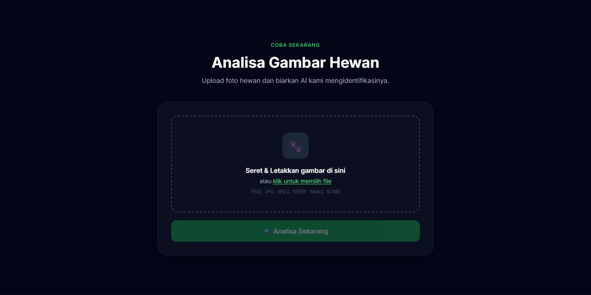
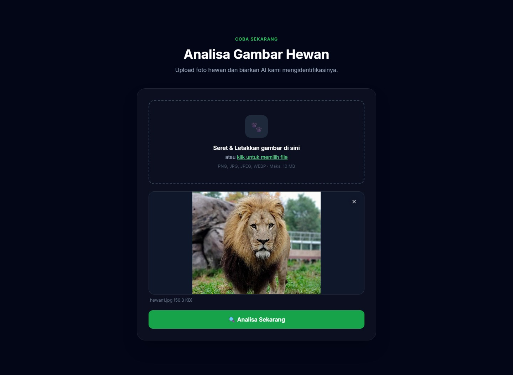
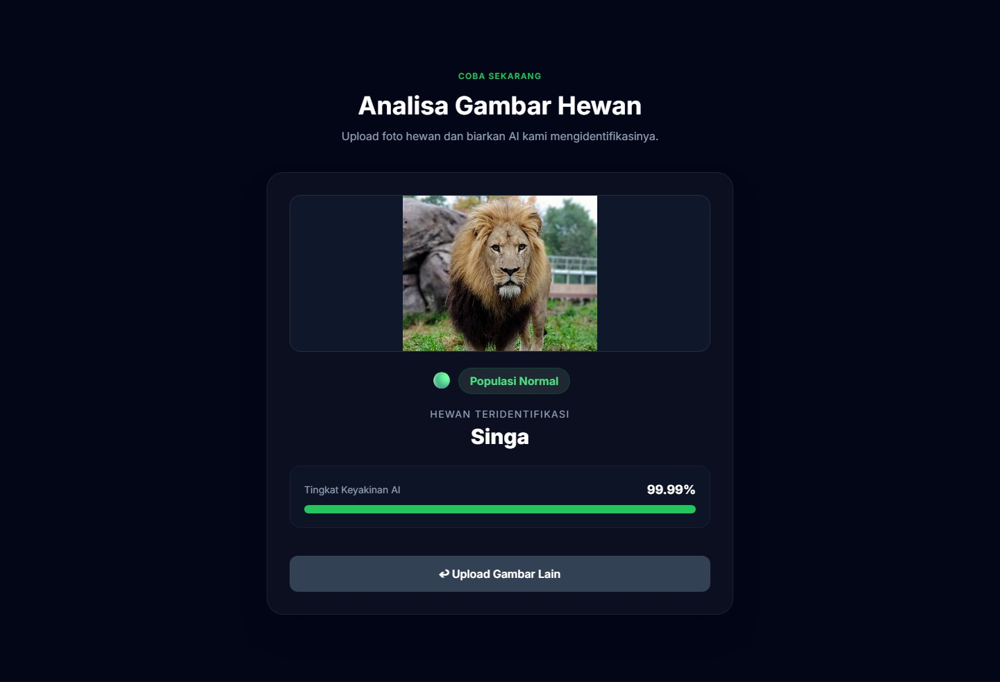

18:48
<!-- ══════════════════════════════════════════════════════════ HEADER ══════════════════════════════════════════════════════════ --> 
  
   
  
 <h1 align="center">🐾 FaunaGuard AI</h1> 
 <b>AI Platform for Identification & Conservation of Indonesian Wildlife</b> 
 
  &nbsp;  &nbsp;  &nbsp;  &nbsp;  
 
 <a href="#-about-the-project">About</a> &nbsp;•&nbsp; <a href="#-key-features">Features</a> &nbsp;•&nbsp; <a href="#-prerequisites">Prerequisites</a> &nbsp;•&nbsp; <a href="#-installation">Installation</a> &nbsp;•&nbsp; <a href="#-project-structure">Structure</a> &nbsp;•&nbsp; <a href="#-license">License</a> 
  
<!-- ══════════════════════════════════════════════════════════ ABOUT ══════════════════════════════════════════════════════════ -->
🌿 About the Project

 <b>FaunaGuard AI</b> is a web application based on <i>deep learning</i> that can identify animal species from a photo while simultaneously detecting whether the animal is classified as <b>Rare (Endangered)</b> or <b>Normal</b>. 
 
 Built using the <b>InceptionV3</b> architecture with <i>transfer learning</i> from ImageNet, the model was trained on a dataset of <b>2,087 images</b> covering <b>21 species classes</b> — including 12 endemic Indonesian species that are endangered. 
   <table align="center"> <tr> <td align="center" width="33%">   <b>🌿 About &amp; Conservation</b> </td> <td align="center" width="33%">   <b>✨ Key Features</b> </td> <td align="center" width="33%">   <b>🦁 21-Species Database</b> </td> </tr> <tr> <td align="center" colspan="3">   <b>🔄 How It Works &amp; Tech Stack</b> </td> </tr> </table>   
<b>— Prediction Flow —</b>
 <table align="center"> <tr> <td align="center" width="33%">   <b>1️⃣ Upload Image</b> </td> <td align="center" width="33%">   <b>2️⃣ Preview &amp; Analyze</b> </td> <td align="center" width="33%">   <b>3️⃣ AI Prediction Result</b> </td> </tr> </table>  
<!-- ══════════════════════════════════════════════════════════ FEATURES ══════════════════════════════════════════════════════════ -->
✨ Key Features
<table> <tr> <td width="50%"> <h4>📸 Identification from Photos</h4> 
Upload animal photos from camera, gallery, or the internet. Drag &amp; Drop supported. PNG, JPG, JPEG, WEBP formats up to 10 MB.
 </td> <td width="50%"> <h4>🚨 Real-Time Conservation Status</h4> 
Every prediction result comes with an automatic conservation status — <b>Rare</b> (red) or <b>Normal</b> (green).
 </td> </tr> <tr> <td width="50%"> <h4>📊 Visual Confidence Score</h4> 
The AI's confidence level is displayed as an animated progress bar with a clear accuracy percentage.
 </td> <td width="50%"> <h4>🧠 InceptionV3 Deep Learning</h4> 
Uses transfer learning from ImageNet, specifically optimized for Indonesian &amp; Southeast Asian fauna datasets.
 </td> </tr> <tr> <td width="50%"> <h4>📱 Responsive on All Devices</h4> 
UI built with TailwindCSS CDN — displays perfectly on desktop, tablet, and smartphone without additional installation.
 </td> <td width="50%"> <h4>⚡ Fast Inference</h4> 
Predictions via a REST API JSON endpoint <code>/predict</code>, with results in seconds directly on the same page.
 </td> </tr> </table>  
<!-- ══════════════════════════════════════════════════════════ SPECIES DATABASE ══════════════════════════════════════════════════════════ -->
🦁 Species Database (21 Classes)

 
<b>🔴 Rare / Endangered Animals (12 Species) — click to view</b>
   <table> <tr> <th align="center">No</th> <th align="center">Animal Name</th> <th align="center">Scientific Name</th> <th align="center">Status</th> </tr> <tr> <td align="center">1</td> <td><b>Javan Rhino</b></td> <td><i>Rhinoceros sondaicus</i></td> <td align="center">🔴 Rare</td> </tr> <tr> <td align="center">2</td> <td><b>Proboscis Monkey</b></td> <td><i>Nasalis larvatus</i></td> <td align="center">🔴 Rare</td> </tr> <tr> <td align="center">3</td> <td><b>Sun Bear</b></td> <td><i>Helarctos malayanus</i></td> <td align="center">🔴 Rare</td> </tr> <tr> <td align="center">4</td> <td><b>Rhinoceros Hornbill</b></td> <td><i>Buceros rhinoceros</i></td> <td align="center">🔴 Rare</td> </tr> <tr> <td align="center">5</td> <td><b>Bird of Paradise</b></td> <td><i>Paradisaea minor</i></td> <td align="center">🔴 Rare</td> </tr> <tr> <td align="center">6</td> <td><b>Javan Hawk-Eagle</b></td> <td><i>Nisaetus bartelsi</i></td> <td align="center">🔴 Rare</td> </tr> <tr> <td align="center">7</td> <td><b>Asian Elephant</b></td> <td><i>Elephas maximus</i></td> <td align="center">🔴 Rare</td> </tr> <tr> <td align="center">8</td> <td><b>White Cockatoo</b></td> <td><i>Cacatua alba</i></td> <td align="center">🔴 Rare</td> </tr> <tr> <td align="center">9</td> <td><b>Palm Cockatoo</b></td> <td><i>Probosciger aterrimus</i></td> <td align="center">🔴 Rare</td> </tr> <tr> <td align="center">10</td> <td><b>Leopard</b></td> <td><i>Panthera pardus</i></td> <td align="center">🔴 Rare</td> </tr> <tr> <td align="center">11</td> <td><b>Orangutan</b></td> <td><i>Pongo pygmaeus</i></td> <td align="center">🔴 Rare</td> </tr> <tr> <td align="center">12</td> <td><b>Tapir</b></td> <td><i>Tapirus indicus</i></td> <td align="center">🔴 Rare</td> </tr> </table> 
 
 
<b>🟢 Normal Population Animals (9 Species) — click to view</b>
   <table> <tr> <th align="center">No</th> <th align="center">Animal Name</th> <th align="center">Status</th> </tr> <tr><td align="center">1</td><td><b>Dog</b></td><td align="center">🟢 Normal</td></tr> <tr><td align="center">2</td><td><b>Sheep</b></td><td align="center">🟢 Normal</td></tr> <tr><td align="center">3</td><td><b>Buffalo</b></td><td align="center">🟢 Normal</td></tr> <tr><td align="center">4</td><td><b>Cat</b></td><td align="center">🟢 Normal</td></tr> <tr><td align="center">5</td><td><b>Horse</b></td><td align="center">🟢 Normal</td></tr> <tr><td align="center">6</td><td><b>Butterfly</b></td><td align="center">🟢 Normal</td></tr> <tr><td align="center">7</td><td><b>Lion</b></td><td align="center">🟢 Normal</td></tr> <tr><td align="center">8</td><td><b>Snake</b></td><td align="center">🟢 Normal</td></tr> <tr><td align="center">9</td><td><b>Zebra</b></td><td align="center">🟢 Normal</td></tr> </table> 
  
<!-- ══════════════════════════════════════════════════════════ MODEL ══════════════════════════════════════════════════════════ -->
🧠 Model Architecture & Performance
<table> <tr> <th align="left" width="40%">Parameter</th> <th align="left">Detail</th> </tr> <tr><td><b>Base Model</b></td><td>InceptionV3 (pre-trained ImageNet)</td></tr> <tr><td><b>Input Shape</b></td><td><code>(299, 299, 3)</code></td></tr> <tr><td><b>Technique</b></td><td>Transfer Learning — frozen base + custom head</td></tr> <tr><td><b>Custom Head</b></td><td>GlobalAveragePooling2D → Dense(1024, ReLU) → Dense(21, Softmax)</td></tr> <tr><td><b>Optimizer</b></td><td>Adam (lr = 0.001)</td></tr> <tr><td><b>Loss Function</b></td><td>Categorical Crossentropy</td></tr> <tr><td><b>Epochs</b></td><td>10</td></tr> <tr><td><b>Batch Size</b></td><td>32</td></tr> <tr><td><b>Training Accuracy</b></td><td><b>98.72%</b></td></tr> <tr><td><b>Validation Accuracy</b></td><td><b>96.15%</b></td></tr> <tr><td><b>Dataset</b></td><td>2,087 images · 21 classes (Train: 1667 | Val: 420)</td></tr> </table>  
<!-- ══════════════════════════════════════════════════════════ PREREQUISITES ══════════════════════════════════════════════════════════ -->
📋 Prerequisites
Make sure your device has the following:

<table> <tr> <th align="center">Requirement</th> <th align="center">Minimum Version</th> <th align="center">Notes</th> </tr> <tr> <td>🐍 <b>Python</b></td> <td align="center"><code>3.9 – 3.11</code></td> <td>TensorFlow does not yet support Python 3.12+</td> </tr> <tr> <td>🧠 <b>TensorFlow</b></td> <td align="center"><code>≥ 2.13</code></td> <td>Required to load the model</td> </tr> <tr> <td>🌐 <b>Flask</b></td> <td align="center"><code>≥ 2.3</code></td> <td>Backend web framework</td> </tr> <tr> <td>🖼️ <b>Pillow</b></td> <td align="center"><code>≥ 10.0</code></td> <td>Image preprocessing</td> </tr> <tr> <td>🔢 <b>NumPy</b></td> <td align="center"><code>≥ 1.24</code></td> <td>Array operations</td> </tr> <tr> <td>📦 <b>Model File</b></td> <td align="center"><code>model2.h5</code></td> <td>Place in the <code>models/</code> folder</td> </tr> </table>  
<!-- ══════════════════════════════════════════════════════════ INSTALLATION ══════════════════════════════════════════════════════════ -->
🚀 Installation & Running the App

 
<b>Step 1 — Clone the Repository</b>
  
bash
  git clone https://github.com/username/FaunaGuard_AI_WebApp.git
  cd FaunaGuard_AI_WebApp

 
 
<b>Step 2 — Create a Virtual Environment (Optional but Recommended)</b>
  
bash
  # Windows
  python -m venv venv
  venv\Scripts\activate

  # macOS / Linux
  python3 -m venv venv
  source venv/bin/activate

 
 
<b>Step 3 — Install Dependencies</b>
  
bash
  pip install -r requirements.txt
Or install manually:

bash
  pip install tensorflow flask pillow numpy

 
 
<b>Step 4 — Place the Model File</b>
  
Download the model2.h5 model file and place it inside the models/ folder:

  FaunaGuard_AI_WebApp-main/
  └── models/
      └── model2.h5   ← place here
📥 Download model2.h5 from Google Drive

 
 
<b>Step 5 — Run the Server</b>
  
bash
  python app.py
If successful, the terminal will display:

  [INFO] Loading model…
  [INFO] Model loaded successfully.
   * Running on http://127.0.0.1:5000
Open your browser and go to: http://localhost:5000 🎉

  
<!-- ══════════════════════════════════════════════════════════ PROJECT STRUCTURE ══════════════════════════════════════════════════════════ -->
📁 Project Structure
FaunaGuard_AI_WebApp-main/
│
├── app.py                  # 🚀 Main Flask server + /predict endpoint
├── requirements.txt        # 📦 List of dependencies
│
├── models/
│   └── model2.h5           # 🧠 InceptionV3 model file (download separately)
│
├── templates/
│   └── index.html          # 🌐 Single-page UI (TailwindCSS CDN)
│
├── static/
│   ├── assets/
│   │   └── Logo.png        # 🖼️  FaunaGuard Logo
│   ├── js/
│   │   └── main.js         # ⚡ Frontend logic (upload, preview, results)
│   └── uploads/             # 📂 Temporary storage for uploaded images
│
├── assets/                  # 📸 Screenshots for documentation
│   ├── image1.jpg
│   ├── image2.jpg
│   ├── image3.jpg
│   └── image4.jpg
│
└── README.md                # 📖 This documentation
 
<!-- ══════════════════════════════════════════════════════════ API REFERENCE ══════════════════════════════════════════════════════════ -->
🔌 API Reference

 
<b>POST /predict — Main Prediction Endpoint</b>
  
Request:

  Content-Type: multipart/form-data
  Body: file = <image_file>
Response (success):

json
  {
    "label": "Orangutan",
    "confidence": 97.84,
    "status": "Rare",
    "image_url": "/static/uploads/abc123.jpg",
    "top3": [
      { "label": "Orangutan",       "confidence": 97.84 },
      { "label": "Proboscis Monkey","confidence": 1.52  },
      { "label": "Sun Bear",        "confidence": 0.64  }
    ]
  }
Response (error):

json
  { "error": "Descriptive error message" }
<table> <tr> <th align="center">HTTP Code</th> <th align="center">Condition</th> </tr> <tr><td align="center"><code>200</code></td><td>Prediction successful</td></tr> <tr><td align="center"><code>400</code></td><td>No file / invalid format</td></tr> <tr><td align="center"><code>503</code></td><td>Model not yet loaded</td></tr> <tr><td align="center"><code>500</code></td><td>Failed to process image</td></tr> </table> 
  
<!-- ══════════════════════════════════════════════════════════ TECH STACK ══════════════════════════════════════════════════════════ -->
🛠️ Tech Stack
<table align="center"> <tr> <th align="center">Layer</th> <th align="center">Technology</th> <th align="center">Purpose</th> </tr> <tr> <td align="center"><b>AI / ML</b></td> <td align="center">TensorFlow 2.x · Keras · InceptionV3</td> <td align="center">Model training &amp; inference</td> </tr> <tr> <td align="center"><b>Backend</b></td> <td align="center">Python 3.11 · Flask · Pillow · NumPy</td> <td align="center">Server &amp; image preprocessing</td> </tr> <tr> <td align="center"><b>Frontend</b></td> <td align="center">HTML5 · TailwindCSS CDN · Vanilla JS</td> <td align="center">Responsive &amp; interactive UI</td> </tr> </table>  
<!-- ══════════════════════════════════════════════════════════ LICENSE ══════════════════════════════════════════════════════════ -->
📜 License

 This project was created for <b>education and wildlife conservation research</b> purposes. Distributed under the <a href="LICENSE"><b>MIT License</b></a>. 

MIT License — Copyright (c) 2024 FaunaGuard AI Team

Permission is hereby granted, free of charge, to any person obtaining a copy
of this software and associated documentation files (the "Software"), to deal
in the Software without restriction, including without limitation the rights
to use, copy, modify, merge, publish, distribute, sublicense, and/or sell
copies of the Software.
 
<!-- ══════════════════════════════════════════════════════════ FOOTER ══════════════════════════════════════════════════════════ --> 
  
 
 <b>FaunaGuard AI</b> — <i>Protect Animals Before It's Too Late</i> 🌿 
 
 Made with ❤️ for Indonesian wildlife conservation 
 
  &nbsp;  &nbsp;  

